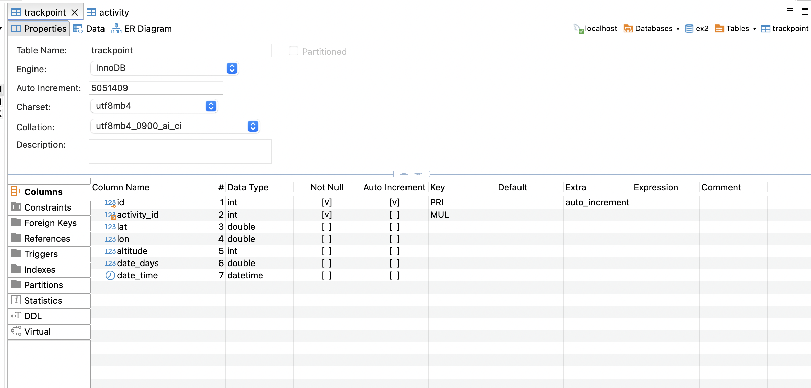
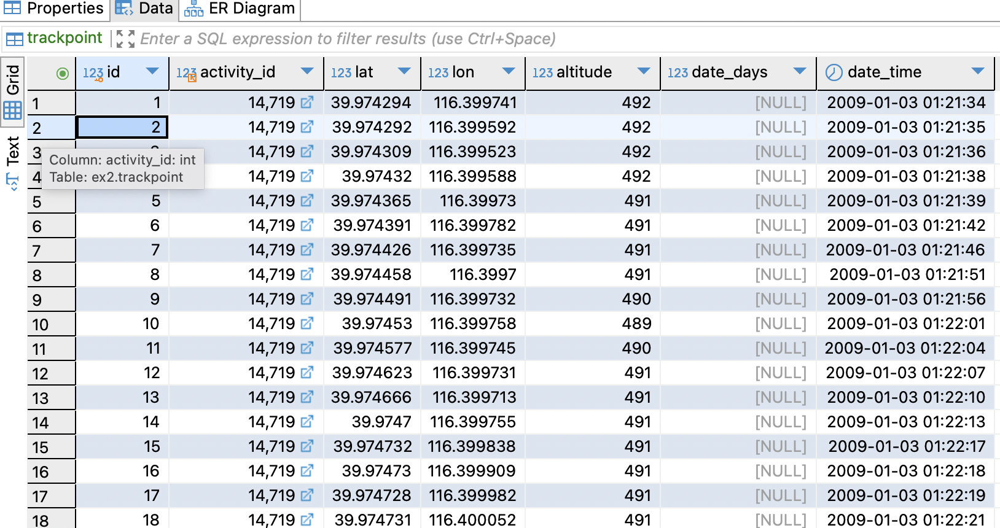
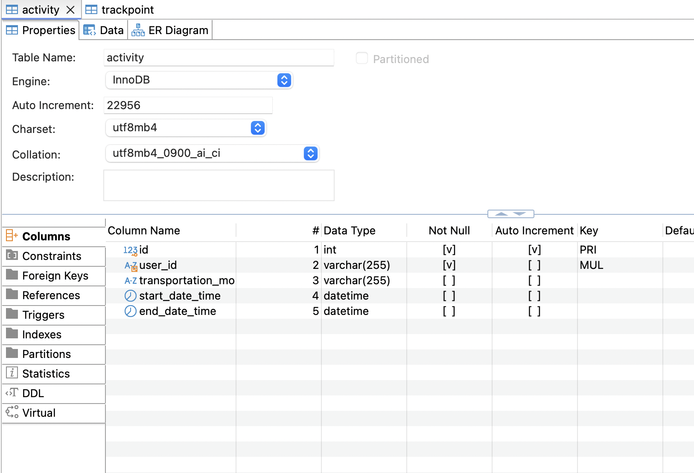
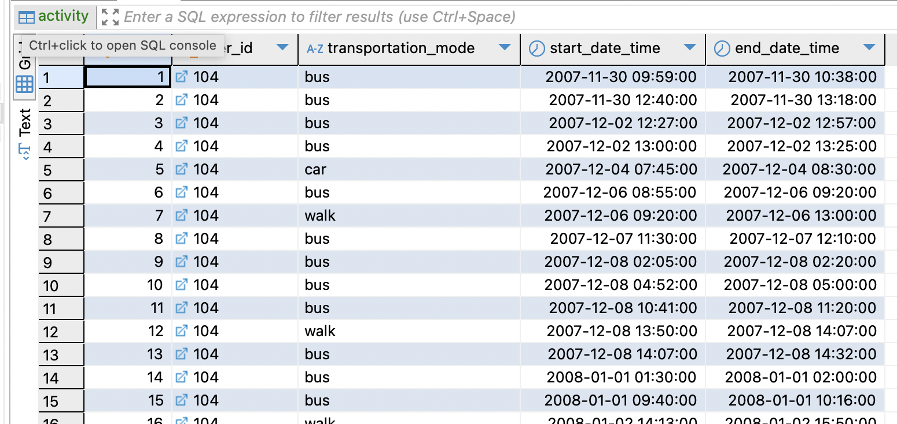
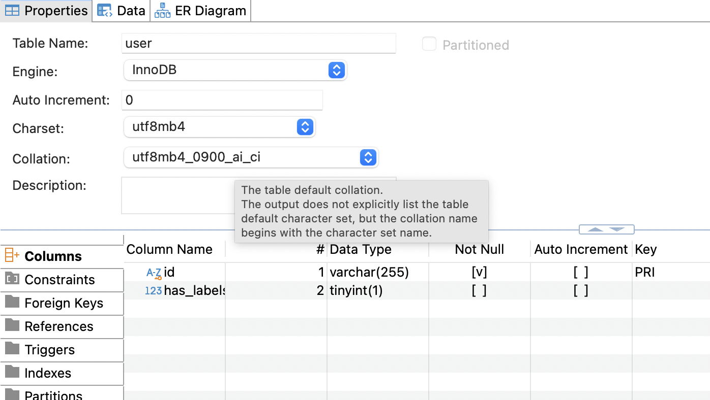
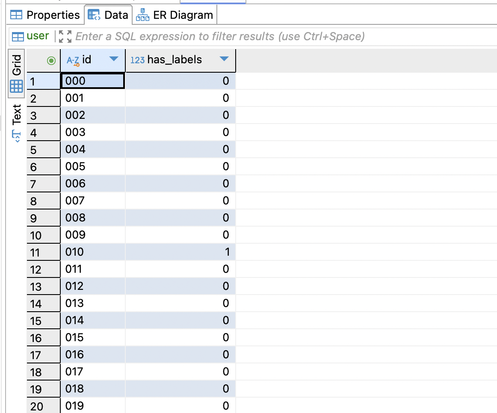

<div align="center">

# TDT4225 - Assignment 2

</div>

<div align="center">

#### Group: XX

#### Author: Sebastian Småland

</div>

## Introduction

The provided exercise includes a dataset of trajectories, derived from a modified version of the Geolife GPS Trajectory dataset. Additionally, it contained code snippets for database connectivity using Python and examples of various MySQL queries. The primary objectives were to preprocess the dataset, design appropriate tables in a MySQL database, populate these tables with the cleaned data, and perform a series of queries via Python to extract meaningful insights from the database. The dataset is available here: [Geolife Trajectories 1.3](https://download.microsoft.com/download/F/4/8/F4894AA5-FDBC-481E-9285-D5F8C4C4F039/Geolife%20Trajectories%201.3.zip)

The repository can be found at [plebbimon/tdt4225](https://github.com/plebbimon/tdt4225).

## Setup

This project relies on poetry for dependency management. Once poetry is installed, we can proceed with installing the project dependencies. To install the required dependencies, run the following command:

```bash
poetry install
```

One can also enter the shell the same way as you would with any other venv:

```bash
poetry shell
```

## Usage

To insert data into the database, run the following command:

```bash
poetry run python insertion_script.py
```

To run the queries, run the following command:

```bash
poetry run python queries.py
```

## Part 1 - Insertion
So I decided to go for displaying the data using DBeaver as a visual crutch for my own sanity's sake. I've included a screenshot of the tables in the database below.








Data modeling wise, I've tried to map it as close as possible to the suggested format. Otherwise there's little to say in the way of the insertion script, as it's just a matter of reading the data and inserting it into the database. I've also added a few print statements to give some feedback on the progress of the script, although this might just create more confusion than it helps.

Concerning memory, I'm pretty sure that I've not made unnessecary complexity when iterating to insert the data, but there's certainly room for improvement as to how the checks are made for the relation between labeled activities and the trackpoints which don't belong to any activity.

If the code still appears to be missing bulk inserts into the db, that is probably fixed in the most recent version found in the github repo.


## Results

### Task 1:

The table shows the following results for (respectively) user_id and trajectory_count:
| Table | Rows |
|------------|---------|
| activity | 30766 |
| trackpoint | 9681756 |
| user | 182 |

Not much to say here except there seems to be a lot of trackpoints, and the activity table is relatively small compared to the trackpoint table. This is due to unlabeled activities mapping a whole trackingpoint file, which should include more than one activity for most occurrences.

### Task 2:
Average number of activities per user:

| Average activities per user |
| --------------------------- |
| 177.838                     |


### Task 3:
Top 20 users with the most activities:

| user_id | Number of activities |
| ------- | -------------------- |
| 163     | 3886                 |
| 128     | 3039                 |
| 153     | 2916                 |
| 085     | 1662                 |
| 062     | 1473                 |
| 167     | 1264                 |
| 068     | 1249                 |
| 025     | 715                  |
| 126     | 683                  |
| 084     | 591                  |
| 144     | 572                  |
| 075     | 517                  |
| 010     | 516                  |
| 052     | 482                  |
| 112     | 428                  |
| 041     | 399                  |
| 020     | 368                  |
| 179     | 362                  |
| 004     | 346                  |
| 140     | 345                  |

This seems to be correct as well, judging by the total count of activities compared to >20th user.

### Task 4:
All users who've taken a taxi:

| User |
| ---- |
| 010  |
| 020  |
| 021  |
| 052  |
| 056  |
| 058  |
| 062  |
| 065  |
| 068  |
| 075  |
| 078  |
| 080  |
| 082  |
| 084  |
| 085  |
| 091  |
| 098  |
| 100  |
| 102  |
| 104  |
| 105  |
| 111  |
| 114  |
| 118  |
| 126  |
| 128  |
| 139  |
| 147  |
| 153  |
| 154  |
| 161  |
| 163  |
| 167  |
| 175  |
| 179  |

### Task 5:

| transportation_mode | Number of activities |
| ------------------- | -------------------- |
| walk                | 6460                 |
| bus                 | 2853                 |
| bike                | 2089                 |
| taxi                | 1179                 |
| car                 | 993                  |
| subway              | 813                  |
| train               | 299                  |
| airplane            | 17                   |
| boat                | 7                    |
| run                 | 6                    |
| motorcycle          | 2                    |

### Task 6:

| Year | Number of activities |
| ---- | -------------------- |
| 2008 | 14739                |

2008 seems to be the year with the most activities. As we can see from the table below, it is also the year with the most hours spent on activities. I'm a bit thrown off by the year 2000 being in the mix here, which is probably due to some careless/ignorant data cleaning. The year 2000 is not a valid year for this dataset, and should be removed.

| Year | Hours   |
| ---- | ------- |
| 2007 | 4440.96 |
| 2008 | 16617   |
| 2011 | 1644.51 |
| 2009 | 14154.4 |
| 2012 | 719.884 |
| 2010 | 1725.74 |
| 2000 | 0.0511  |

### Task 7:

Total distance walked by user 112:

| User | Meters     |
|------|------------|
| 112  | 149314.532m|

149km seems like a lot, until you realize it's over such a long period. Even though, I still had to do a double take.
### Task 8:
This resulted in the slowest query I've had the displeasure of using, and I believe it's suboptimal (as in "terrible and should never be presented to anyone with sensible opinions") in some way - I just couldn't be bothered to fix it once I actually got a result in reasonable time.

|   user_id |   total_feet_gained |
|-----------|---------------------|
|       128 |         1.52967e+06 |
|       153 |         1.27025e+06 |
|       004 |    728755           |
|       085 |    606442           |
|       163 |    518639           |
|       003 |    475843           |
|       167 |    383889           |
|       084 |    378987           |
|       030 |    377285           |
|       039 |    290069           |
|       144 |    283392           |
|       062 |    245067           |
|       000 |    243650           |
|       002 |    243086           |
|       126 |    237289           |
|       041 |    225998           |
|       025 |    188351           |
|       115 |    157542           |
|       096 |    144134           |
|       028 |    136108           |

Now there's clearly some shenanigans going on here, as the total feet gained is in the millions. This is probably due to the query logic, as well as my lack of understanding of the criteria for how altitude is "gained" (as in, is it the min point vs max point, or simply the sum for all points? Then it follows that a person with tons of trackpoints in an elevator or something would have extreme numbers...).

### Task 9:

The table shows the following results for (respectively) user_id and invalid_activity_count:

---

      128                       898
      153                       585
      062                       385
      163                       265
      025                       263
      085                       258
      004                       219
      041                       201
      003                       179
      167                       165
      144                       158
      068                       154
      039                       147
      126                       141
      084                       130
      017                       129
      014                       118
      030                       112
      092                       104
      000                       101
      037                       100
      002                        98
      104                        97
      115                        95
      112                        88
      034                        88
      140                        86
      091                        73
      052                        62
      038                        58
      022                        55
      042                        55
      174                        54
      142                        52
      089                        51
      101                        50
      010                        50
      015                        46
      001                        45
      005                        45
      012                        43
      096                        36
      028                        36
      051                        36
      179                        35
      020                        34
      067                        34
      036                        34
      011                        32
      044                        32
      134                        31
      009                        31
      019                        31
      007                        30
      155                        30
      147                        30
      065                        29
      111                        29
      013                        29
      071                        29
      082                        28
      024                        27
      018                        27
      125                        26
      078                        25
      029                        25
      073                        24
      103                        24
      035                        23
      139                        22
      119                        22
      097                        21
      081                        21
      058                        21
      043                        21
      102                        20
      016                        20
      105                        19
      168                        19
      074                        19
      026                        18
      040                        17
      006                        17
      110                        17
      150                        16
      008                        16
      057                        16
      094                        16
      069                        15
      083                        15
      055                        15
      181                        14
      154                        14
      053                        13
      046                        13
      129                        12
      021                        12
      032                        12
      061                        12
      098                        11
      138                        11
      108                        11
      056                        11
      023                        11
      099                        11
      088                        11
      076                        10
      131                        10
      075                         9
      157                         9
      158                         9
      169                         9
      172                         9
      162                         9
      175                         8
      080                         8
      086                         8
      063                         8
      130                         8
      050                         8
      176                         8
      161                         7
      064                         7
      045                         7
      146                         7
      047                         6
      136                         6
      164                         6
      066                         6
      122                         6
      107                         5
      114                         5
      135                         5
      159                         5
      070                         5
      173                         5
      145                         5
      059                         5
      087                         4
      133                         4
      127                         4
      121                         4
      117                         4
      095                         4
      093                         4
      124                         4
      170                         3
      132                         3
      077                         3
      031                         3
      090                         3
      118                         3
      109                         3
      100                         3
      106                         3
      123                         3
      171                         3
      060                         2
      166                         2
      079                         2
      054                         2
      180                         2
      165                         2
      152                         2
      027                         2
      072                         2
      033                         2
      151                         1
      048                         1
      141                         1
      113                         1


### Task 10:
All users who've been in the Forbidden City:

|   user_id |
|-----------|
|       131 |
|       018 |
|       004 |

Now I've just rounded the numbers to the nearest three decimal points, but this could be regarded as unpresice. I'm not sure if it's a relevant problem, but I find it worth mentioning.

### Task 11:
The table shows the following results for (respectively) user_id and transportation_mode:
|   user_id | Most used transportation mode   |
|-----------|---------------------------------|
|       010 | walk                            |
|       020 | bike                            |
|       021 | car                             |
|       052 | bus                             |
|       053 | walk                            |
|       056 | bike                            |
|       058 | walk                            |
|       059 | walk                            |
|       060 | walk                            |
|       062 | bus                             |
|       064 | walk                            |
|       065 | bike                            |
|       067 | walk                            |
|       068 | bike                            |
|       069 | walk                            |
|       073 | walk                            |
|       075 | walk                            |
|       076 | car                             |
|       078 | walk                            |
|       080 | walk                            |
|       081 | walk                            |
|       082 | walk                            |
|       084 | walk                            |
|       085 | walk                            |
|       086 | car                             |
|       087 | walk                            |
|       088 | bus                             |
|       089 | car                             |
|       091 | walk                            |
|       092 | walk                            |
|       096 | bike                            |
|       097 | bike                            |
|       098 | walk                            |
|       100 | walk                            |
|       101 | car                             |
|       102 | walk                            |
|       104 | bus                             |
|       105 | walk                            |
|       106 | car                             |
|       107 | walk                            |
|       108 | walk                            |
|       110 | walk                            |
|       111 | taxi                            |
|       112 | walk                            |
|       114 | taxi                            |
|       115 | car                             |
|       116 | bike                            |
|       117 | walk                            |
|       118 | car                             |
|       124 | bus                             |
|       125 | bike                            |
|       126 | walk                            |
|       128 | car                             |
|       129 | bike                            |
|       136 | walk                            |
|       138 | walk                            |
|       139 | walk                            |
|       141 | walk                            |
|       144 | car                             |
|       147 | walk                            |
|       153 | walk                            |
|       154 | walk                            |
|       161 | walk                            |
|       163 | walk                            |
|       167 | walk                            |
|       170 | walk                            |
|       174 | car                             |
|       175 | walk                            |
|       179 | walk                            |

Worth mentioning here that because I've sorted the transportation modes alphabetically, in tiebreakers bike will be chosen over bus, bus over car, etc.. So I've dealt with the adversity of having to choose between two equally good options by just being lazy.
